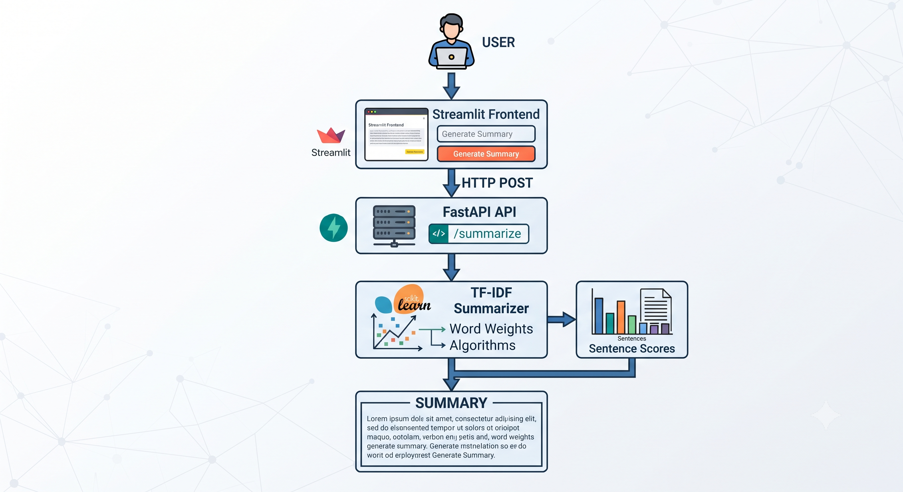

# Text Summarization System

An extractive text summarization system built using Python, NLP, TF-IDF, FastAPI, and Streamlit.

The system identifies important sentences from an input document using TF-IDF-based sentence scoring and generates a configurable-length extractive summary.

## Live Demo

🚀 **[Try the Text Summarization System](https://text-summarization-system.streamlit.app/)**

## Features

* TF-IDF-based extractive summarization
* Configurable summary length
* English stopword removal
* FastAPI REST API
* Streamlit web interface
* Input validation
* Summary statistics
* Downloadable summaries
* Automated tests

## Problem Statement

Long documents can be difficult and time-consuming to read. The goal of this project is to automatically identify important sentences from a document and produce a shorter summary while preserving the original wording.

## How It Works

The summarization pipeline follows these steps:

1. The input document is split into sentences using NLTK sentence tokenization.
2. English stopwords are removed during TF-IDF processing.
3. TF-IDF vectors are calculated for each sentence.
4. The mean TF-IDF score is calculated for each sentence.
5. Sentences are ranked according to their scores.
6. The highest-ranked sentences are selected according to the requested summary length.
7. The selected sentences are restored to their original document order.
8. The resulting sentences form the final extractive summary.

## TF-IDF-Based Sentence Scoring

TF-IDF (Term Frequency-Inverse Document Frequency) is used to represent the importance of words within the input document.

For each sentence, the system calculates the mean TF-IDF value of its terms. This produces a sentence-level score that is used to rank sentences.

Higher-scoring sentences are considered more relevant according to the TF-IDF representation and are selected for the summary.

## Architecture

The project contains two main components:

* **Streamlit frontend** — provides the user interface and runs the summarization workflow in the deployed application.
* **FastAPI backend** — provides a REST API for programmatic access to the summarization system.

The deployed Streamlit application currently runs the summarization function directly. The FastAPI backend is included for API-based usage and future deployment.

### Architecture Diagram



## API

### POST `/summarize`

The FastAPI backend exposes a `/summarize` endpoint.

#### Example Request

```json
{
  "text": "Machine learning is useful. Python is widely used for machine learning.",
  "summary_length": 1
}
```

#### Example Response

```json
{
  "summary": "Machine learning is useful."
}
```

## Project Structure

```text
text-summarization-system/
│
├── backend/
│   ├── __init__.py
│   ├── main.py
│   └── summarizer.py
│
├── frontend/
│   └── app.py
│
├── tests/
│   ├── test_summarize.py
│   └── test_api.py
│
├── architecture.png
├── pytest.ini
├── requirements.txt
├── .gitignore
└── README.md
```

## Installation

### 1. Clone the Repository

```bash
git clone https://github.com/Sharon1004/text-summarization.git
cd text-summarization
```

### 2. Create a Virtual Environment

```bash
python -m venv venv
```

### 3. Activate the Virtual Environment

On Windows:

```bash
venv\Scripts\activate
```

### 4. Install Dependencies

```bash
pip install -r requirements.txt
```

## Running the Application

### Start the FastAPI Backend

```bash
uvicorn backend.main:app --reload
```

### Start the Streamlit Frontend

Open another terminal and run:

```bash
streamlit run frontend/app.py
```

The Streamlit application will open in your browser using the local URL displayed in the terminal.

## Running Tests

Run the automated tests using:

```bash
pytest
```

The tests cover core summarization behavior and API validation.

## Limitations

* The system performs extractive rather than abstractive summarization.
* It selects existing sentences instead of generating new sentences.
* TF-IDF does not capture deep semantic relationships between sentences.
* A high TF-IDF score does not always correspond to human judgments of sentence importance.
* The system does not use contextual language understanding provided by modern transformer-based models.

## Future Improvements

Potential future improvements include:

* Semantic sentence embeddings
* Transformer-based summarization
* ROUGE-based evaluation
* Improved semantic sentence ranking

These improvements are outside the scope of the current version.

## Technologies Used

* Python
* NLTK
* NumPy
* Scikit-learn
* FastAPI
* Pydantic
* Streamlit
* Pytest

## License

This project is intended for educational and portfolio purposes.
